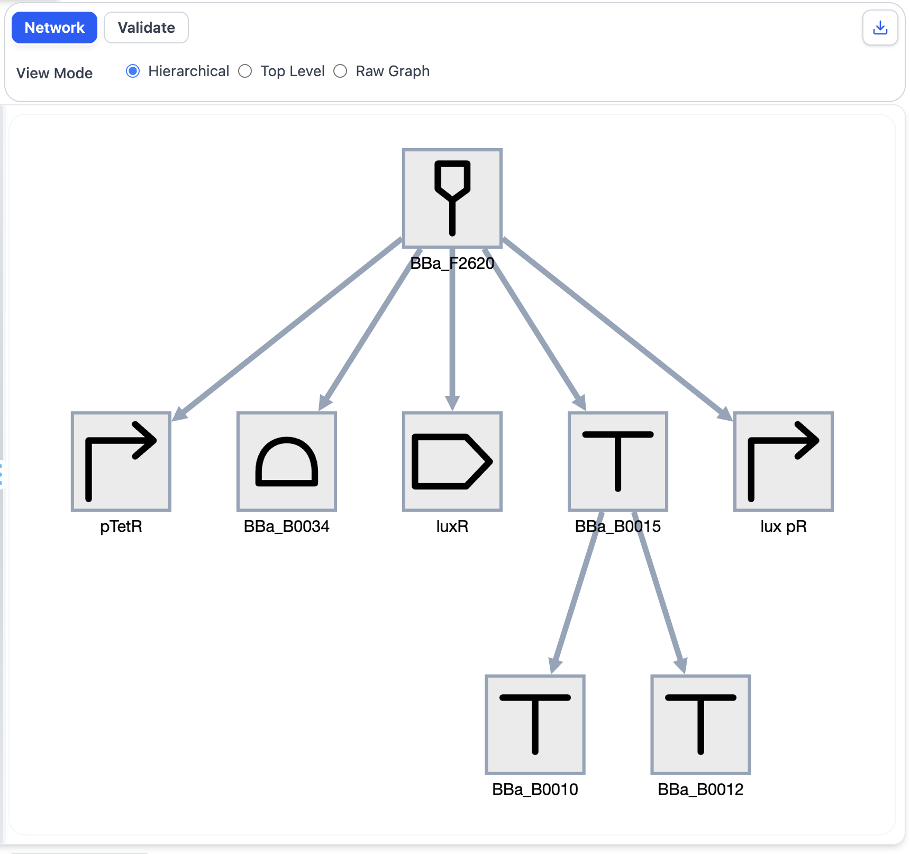
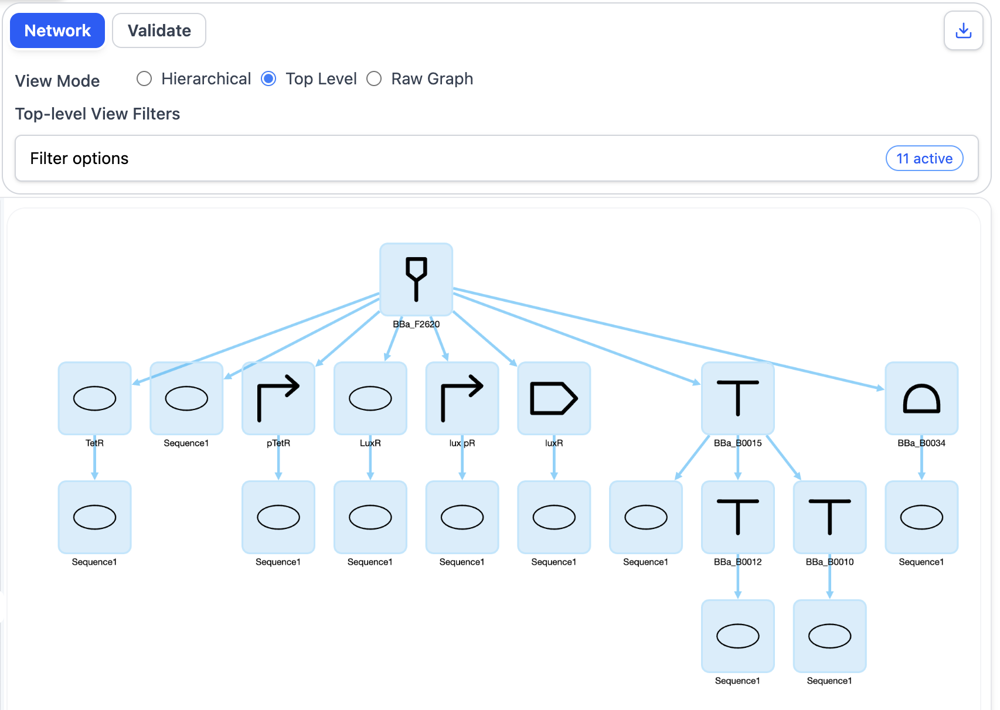
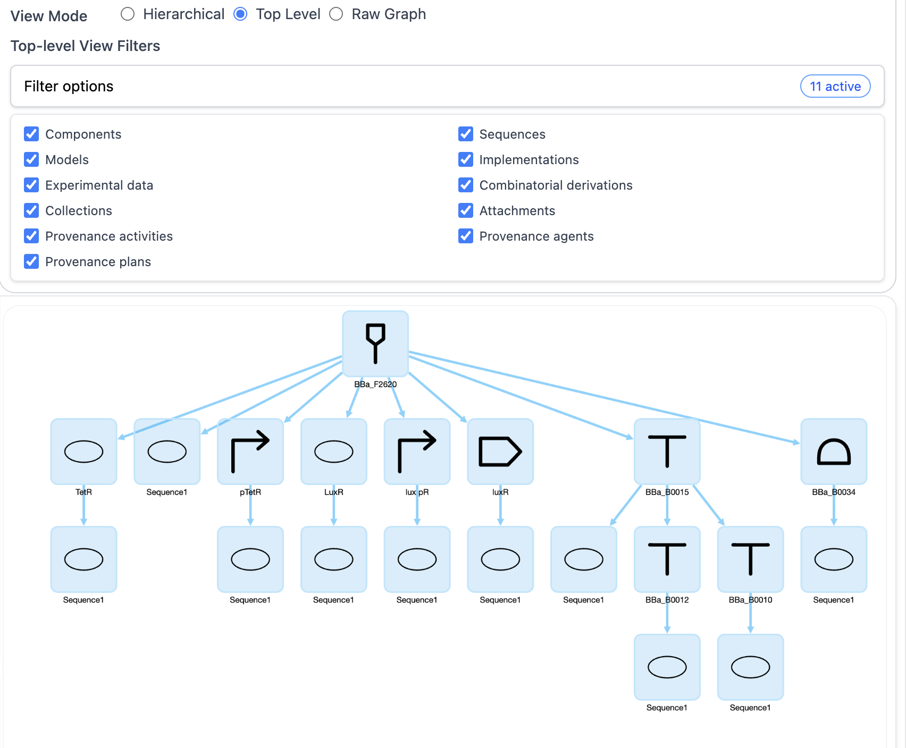
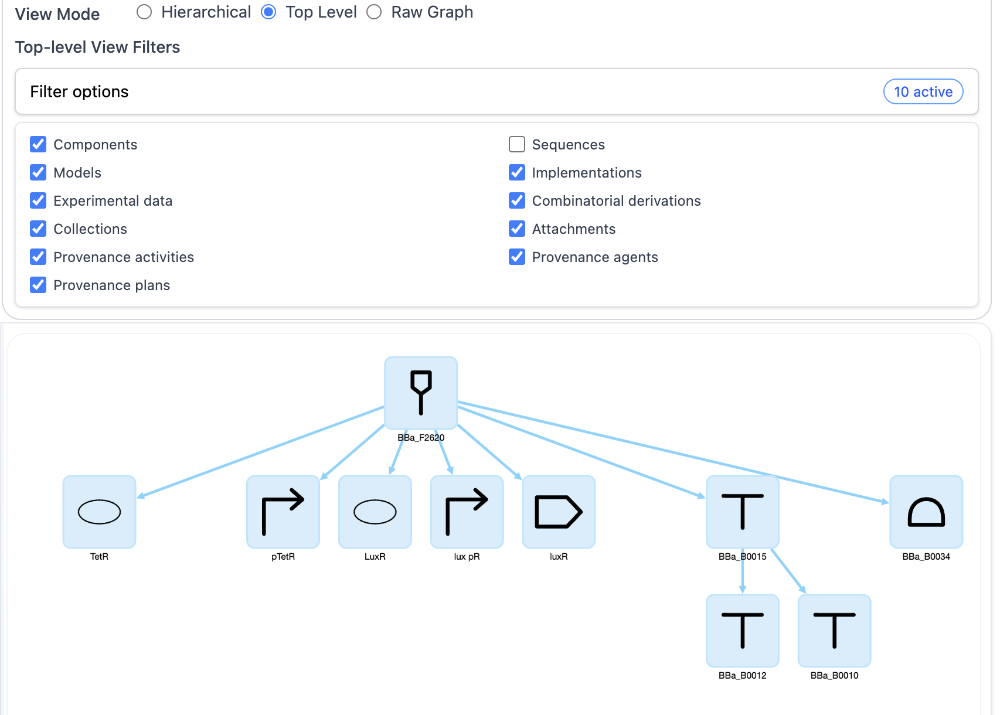
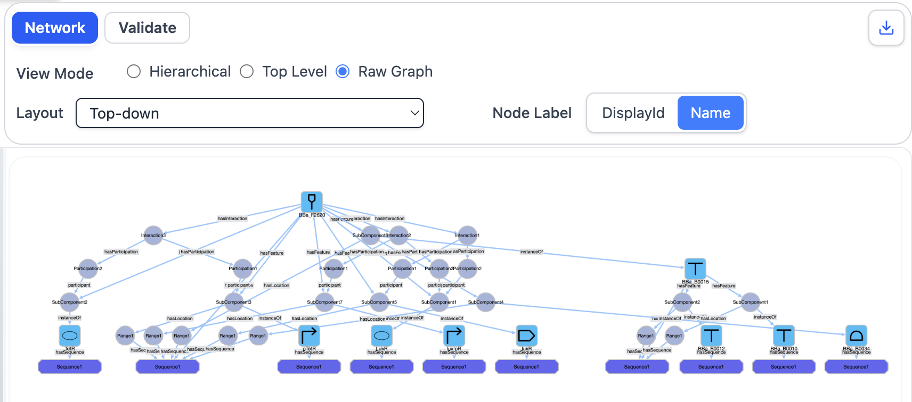
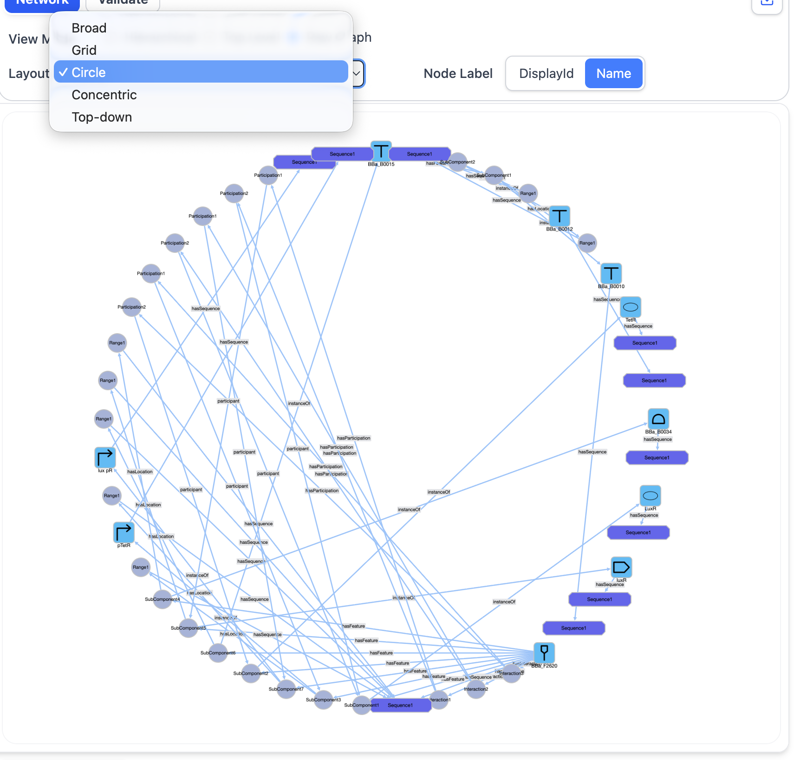

# Network View

## Objective

The Network View provides an interactive graph-based representation of a design document. It enables users to examine the entities contained in a design and the relationships between them at different levels of abstraction.

In this section, the same SBOL design will be examined using three different representations:

- **Hierarchical View**
- **Top Level View**
- **Raw Graph View**

Comparing these representations demonstrates how SynBioKit can provide both simplified design-oriented views and detailed representations of the underlying SBOL structure.

---

## Example Design

This section uses the following SBOL document:

**`BBa_F2620_PoPSReceiver.ttl`**

[Open the example file](../examples/BBa_F2620_PoPSReceiver.ttl)

The document represents an SBOL design that will be used throughout this section to demonstrate the different Network View representations.

---

## Loading the Design

1. Open SynBioKit in a web browser.
2. Open `BBa_F2620_PoPSReceiver.ttl` from the tutorial repository.
3. Copy the complete contents of the file.
4. Paste the content into the input panel on the left-hand side of SynBioKit.

After the design is processed, SynBioKit automatically displays the document in the **Network View**.

The Network View represents SBOL entities as nodes and the relationships between them as edges.

---

# Hierarchical View

## Overview

This view designed especially for the Biologists.

It presents the biological design as a hierarchical structure form top to bottom.

The purpose of this view is the show how the main components are organized especially in complex designs as clear as possible.

One of the most important features of this view is the actual its focus on the actual biological design components.

All the other details are hidden from the user.

Only the structures that biologist are interested in are shown in the screen.

## Procedure

1. Ensure that `BBa_F2620_PoPSReceiver.ttl` is loaded in SynBioKit.
2. Select **Hierarchical View** from the available Network View options.
3. Examine the entities displayed in the graph.
4. Select individual nodes to inspect the corresponding SBOL entities.
5. Use right-click function to hide and show the child entities.
6. Download the generated graph image from the top right button.

## Expected Outcome

The design should now be represented as a hierarchical structure.

The relationships between higher-level design entities and their associated elements should be more explicit than in the Top-Level View.

> **Observation**
>
> Identify the principal entities visible in the graph. Consider which information from the original SBOL document is not represented in this view.

<!-- Add screenshot here -->

---

# Top Level View

## Overview

The Top Level View provides a simplified representation of the SBOL document by displaying its principal design entities while hiding lower-level structural details.

This representation is useful for obtaining an initial overview of a design without exposing every entity and relationship contained in the underlying SBOL document.

## Procedure

1. Select the Network View representation to **Top Level View**.
2. Examine how the structure differs from the Hierarchical View.
3. Identify parent and child relationships within the design.
4. Select different entities to examine their position within the hierarchy.
5. Use right-click function to hide and show the child entities.
6. Download the generated graph image from the top right button.

## Expected Outcome

The graph should provide a concise representation of the Top Level entities contained in the design.

> **Observation**
>
> Compare the Top Level View representation with the Hierarchical View. Identify which structural relationships become visible when the hierarchy of the design is considered.

## Procedure (Continue)

7. Open the filters and examine.
8. Select filters and see the result.

---

# Raw Graph View

## Overview

The Raw Graph View provides the most detailed graph representation available in the Network View.

It displays the SBOL entities and relationships derived directly from the document structure, with significiantly less abstraction than the Top-Level or Hierarchical representations.

This view is useful when detailed inspection of an SBOL document is required.

## Procedure

1. Change the representation to **Raw Graph View**.
2. Examine the number and types of nodes displayed.
3. Inspect the relationships connecting the entities.
4. Select several nodes and compare them with the corresponding information in the original SBOL document.
5. Use right-click function to hide and show the child entities.
6. Download the generated graph image from the top right button.

## Expected Outcome

The graph should contain considerably more detail than the previous two representations.

Entities and relationships that were hidden or abstracted in the Top-Level and Hierarchical views should now be visible.

> **Observation**
>
> Compare the Raw Graph View with the previous representations. Consider the trade-off between structural detail and readability.

<!-- Add screenshot here -->

## Procedure (Continue)

7. Change the layouts.
8. Examine the result.

---

## Further Exploration

Additional design examples are available in the [`examples`](../examples/) directory of this repository.

Select one or more of these example files and examine them using the three Network View representations introduced in this section:

- **Hierarchical View**
- **Top Level View**
- **Raw Graph View**

For each design:

1. Copy the complete contents of the selected file into the SynBioKit input panel.
2. Examine the design using the **Hierarchical View**.
3. Switch to the **Top Level View** and compare the entities and relationships displayed.
4. Apply different filters where appropriate and observe how the graph changes.
5. Examine the same design using the **Raw Graph View**.
6. Apply different graph layouts and assess their effect on the readability of the design.

When comparing the different examples, consider how the complexity and structure of each design affect its representation across the three views.

> **Observation**
>
> Consider which Network View provides the most useful representation for each design and how this depends on the level of structural detail required.

---

# Comparison of Network Representations

The three Network View representations provide different levels of abstraction over the same SBOL document.

| View                  | Primary Purpose                                                                | Level of Detail |
| --------------------- | ------------------------------------------------------------------------------ | --------------- |
| **Hierarchical View** | Provides an overview of the main design components as a hierarchical structure | Low             |
| **Top Level View**    | Presents the main entities and their relationships                             | Medium          |
| **Raw Graph View**    | Exposes detailed SBOL entities and relationships                               | High            |

The appropriate representation therefore depends on the type of analysis being performed.

The **Hierarchical View** provides a simplified design-oriented representation by focusing on fundamental biological design components, such as promoters, RBSs, CDSs, and terminators. The **Top Level View** presents a broader representation of the SBOL document by including additional entities such as Sequences, Models, and Component References. The **Raw Graph View** provides the most detailed representation, exposing the underlying SBOL entities and relationships with minimal abstraction.

---

## Section Summary

In this section, a single SBOL document was examined using three different Network View representations.

The exercise demonstrated how SynBioKit provides multiple levels of abstraction for analysing the same biological design:

**Hierarchical View → Top Level View → Raw Graph View**

These representations allow users to move from a simplified overview of a design to a detailed examination of its underlying SBOL structure.

[Next: Validation →](04-validation.md)
