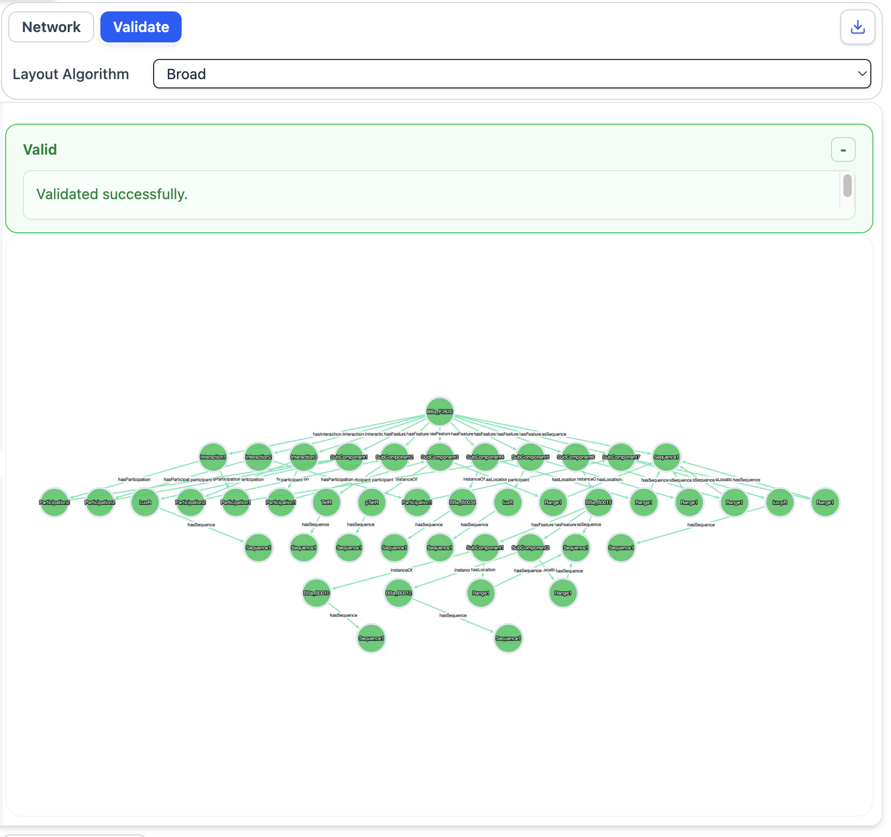
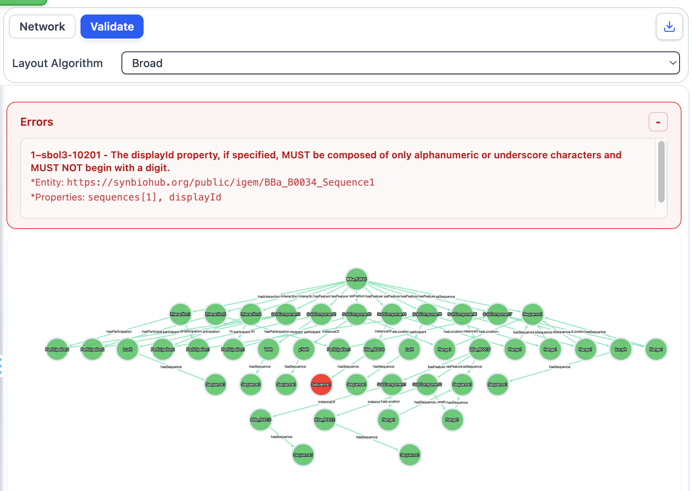

# Validation

## Objective

The Validation View enables users to assess whether a design document conforms to the rules and constraints defined by the SBOL specification.

In addition to reporting the validation result, SynBioKit presents the entities and relationships associated with the document. When validation errors are detected, the corresponding error information can be examined together with the relevant parts of the design.

In this section, you will:

- Validate an SBOL document
- Examine the validation result
- Inspect the entities and relationships associated with the document
- Identify validation errors in an invalid design
- Examine the design elements associated with reported errors

---

## Validation View

The Validation View combines SBOL validation with a graphical representation of the design.

The validation result indicates whether the submitted document satisfies the requirements of the SBOL specification.

A document may contain validation issues related to, for example:

- Incorrect or incomplete entity definitions
- Invalid relationships between SBOL entities
- Missing required information
- References to entities that are not defined correctly
- Violations of constraints defined by the SBOL specification

The purpose of the Validation View is not only to report these problems, but also to provide contextual information that can help users understand where they occur within the design.

---

# Validating an SBOL Document

## Procedure

1. Open an SBOL example from the [`examples`](../examples/) directory.

2. Copy the complete contents of the file.

3. Paste the document into the input panel on the left-hand side of SynBioKit.

4. Select **Validation View**.

5. Examine the validation result displayed by SynBioKit.

6. Inspect the design entities and relationships shown together with the validation result.

## Expected Outcome

For a valid SBOL document, SynBioKit should indicate that the document successfully passes validation.

The associated graphical representation can then be used to examine the entities and relationships contained in the validated design.

> **Observation**
>
> Examine the validation result and the corresponding design representation. Consider how validation provides information about the correctness of the document that cannot be obtained from visual inspection of the design alone.

<!-- Add screenshot here -->



---

# Introducing a Validation Error

Validation errors can be explored by deliberately modifying a valid SBOL document. In this exercise, the same document used previously will be modified to introduce an invalid `displayId`.

## Procedure

1. Continue using the same SBOL document from the previous validation exercise.

2. Locate the `Sequence` entity:

```turtle
:BBa_B0034_Sequence1 a sbol:Sequence;
```

3. Within this entity, locate its `displayId`:

```turtle
sbol:displayId "BBa_B0034_Sequence1";
```

4. Modify the `displayId` by introducing a character that is not permitted by the SBOL identifier rules. For example, change:

```text
BBa_B0034_Sequence1
```

to:

```text
BBa-B0034-Sequence1
```

The hyphen (`-`) deliberately introduces a non-alphanumeric and non-underscore character into the `displayId`.

5. Leave the remainder of the document unchanged.

6. Open the **Validation View**.

7. Examine the validation result and the reported error message.

8. Identify the entity and properties associated with the validation error.

## Expected Outcome

The modified document should no longer pass validation.

SynBioKit should report the following validation rule:

> **sbol3-10201** — The displayId property, if specified, MUST be composed of only alphanumeric or underscore characters and MUST NOT begin with a digit.
>
> **Entity:** `https://synbiohub.org/public/igem/BBa_B0034_Sequence1`
>
> **Properties:** `sequences[1], displayId`

The error demonstrates that even a small modification to an identifier can cause an otherwise valid SBOL document to violate the SBOL specification.

> **Observation**
>
> Compare the validation result with the result obtained before modifying the `displayId`. Examine how SynBioKit identifies both the violated SBOL rule and the entity associated with the error.



---

# Interpreting Validation Results

Validation provides a complementary perspective to the visualisation capabilities introduced in the previous section.

A design may appear structurally understandable when visualised while still violating one or more SBOL rules. Validation therefore provides an additional mechanism for assessing the correctness and interoperability of a design.

When an error is reported, consider the following questions:

1. Which SBOL rule or constraint has been violated?
2. Which entity or relationship is associated with the error?
3. Which property is responsible for the validation failure?
4. Is the problem caused by an invalid value, missing information, an incorrect reference, or an inconsistent relationship?
5. How could the document be modified to resolve the issue?

This process can be particularly useful when working with large or complex SBOL documents, where identifying problems directly from the source representation may be difficult.

---

## Further Exploration

The previous exercise introduced a relatively simple validation error involving a single `displayId`. In this exercise, a structural inconsistency will be introduced by modifying the location of a `SubComponent`.

### Procedure

1. Restore the original valid `displayId` before continuing:

```text
BBa_B0034_Sequence1
```

2. In the same SBOL document, locate the following `Range`:

```text
BBa_F2620/SubComponent7/Range1
```

3. Locate the `start` value associated with this `Range`.

4. Change the `start` value to:

```text
1
```

5. Leave the remaining properties unchanged.

6. Examine the document using the **Validation View**.

7. Inspect the validation error reported by SynBioKit.

8. Identify the `SubComponent`, `Location`, and `Sequence` involved in the reported validation problem.

### Expected Outcome

The modified location should cause the document to violate the following SBOL validation rule:

> **sbol3-10807** — If a SubComponent object has at least one hasLocation and zero sourceLocation properties, and the Component linked by its instanceOf has precisely one hasSequence property whose Sequence has a value for its elements property, then the sum of the lengths of the Location objects referred to by the hasLocation properties MUST equal the length of the elements value of the Sequence.
>
> **Additional information:** Sequence length: `55`, Calculated location length: `1023`
>
> **Sequence:** `https://synbiohub.org/public/igem/BBa_R0062_Sequence1`
>
> **Entity:** `https://synbiohub.org/public/igem/BBa_F2620/SubComponent7`
>
> **Properties:** `components[7], subComponents[2], hasLocation`

In this case, the error is not caused by the syntax of an individual identifier. Instead, changing the location creates an inconsistency between the length represented by the `SubComponent` location and the length of its associated `Sequence`.

> **Observation**
>
> Compare this error with the `displayId` error introduced previously. Consider how validation can detect inconsistencies between related SBOL entities that may be considerably more difficult to identify through manual inspection of the document.

---

## Section Summary

In this section, the Validation View was used to assess the validity of an SBOL document and investigate different types of validation errors.

The exercises demonstrated how SynBioKit can:

- Determine whether an SBOL document conforms to the SBOL specification
- Report the specific SBOL rule associated with a validation failure
- Identify the entity and properties associated with an error
- Detect lexical constraints, such as an invalid `displayId`
- Detect structural inconsistencies between related entities, such as a mismatch between a `SubComponent` location and its associated `Sequence`
- Provide graphical context to support the investigation of validation problems

The two deliberately introduced errors demonstrate different levels of validation. The first error violates a constraint on an individual property, whereas the second results from an inconsistency between multiple related SBOL entities.

Validation therefore complements SynBioKit's visualisation capabilities by enabling users not only to explore the structure of a biological design, but also to assess whether its underlying SBOL representation is internally consistent and conforms to the specification.

[Next: Converter →](05-converter.md)
