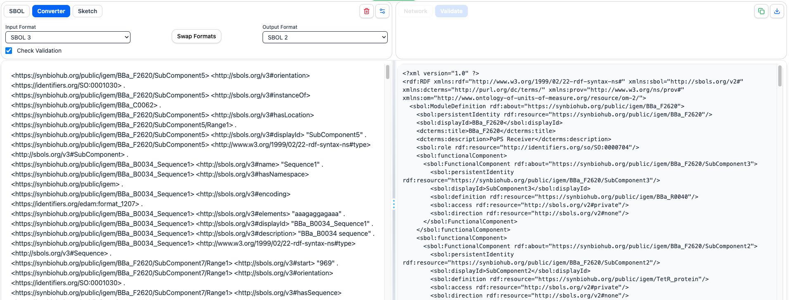

# Converter

## Objective

The Converter module enables biological designs to be transformed between different file formats directly within SynBioKit.

In this section, you will:

- Convert a biological design between supported formats
- Examine the original and converted documents side by side
- Copy and download converted documents
- Explore conversions involving SBOL2, SBOL3, GenBank, and FASTA
- Examine how conversion supports interoperability and backward compatibility between biological design formats

---

## Converter Module

Biological designs are represented using several commonly used formats, and different software tools may support different representations.

The SynBioKit Converter provides an integrated mechanism for transforming designs between supported formats without requiring users to leave the platform or use an external conversion tool.

The Converter supports conversions involving:

- **SBOL3**
- **SBOL2**
- **GenBank**
- **FASTA**

The conversion process is performed using **SBOL Converter**, while SynBioKit provides an interactive web interface for accessing its conversion functionality.

After a conversion is performed, the **original document** and the **converted document** are displayed side by side. The converted document can then be copied or downloaded using the controls provided in the interface.

---

# Converting an SBOL3 Document

In this exercise, an SBOL3 document will be converted to SBOL2.

This conversion demonstrates the backward compatibility functionality provided through SynBioKit.

## Procedure

1. Open the [`examples`](../examples/) directory.

2. Select an example document in **SBOL3** format.

3. Copy the complete contents of the document.

4. Paste the document into the input panel on the left-hand side of SynBioKit.

5. Open the **Converter** module.

6. Select **SBOL2** as the target format.

7. Start the conversion process.

8. Examine the original and converted documents displayed side by side.

9. Compare the structure of the original SBOL3 document with the resulting SBOL2 representation.

10. Use the available controls to:
    - Copy the converted document
    - Download the converted document

## Expected Outcome

SynBioKit should generate an SBOL2 representation of the input SBOL3 design.

The interface should display the original SBOL3 document and the converted SBOL2 document side by side, allowing the two representations to be directly compared.

<!-- Add screenshot here -->

> **Observation**
>
> Compare the original and converted documents. Examine how the same biological design is represented differently in SBOL3 and SBOL2 while preserving the underlying design information.

---

# Backward Compatibility

SBOL has evolved across multiple versions, and biological designs created using earlier versions may still be used by existing software, repositories, and research workflows.

The ability to convert between **SBOL3 and SBOL2** therefore provides an important mechanism for maintaining compatibility between newer and legacy SBOL-based systems.

Within SynBioKit, this functionality enables users to work with SBOL3 designs while still exchanging information with tools and resources that depend on SBOL2.

The conversion functionality is provided by **SBOL Converter** and integrated directly into the SynBioKit workflow through the Converter interface.

---

# Conversion Between Other Biological Design Formats

The Converter is not limited to SBOL2 and SBOL3.

SynBioKit also supports conversions involving **GenBank** and **FASTA**, enabling biological sequence and design information to be exchanged across commonly used formats.

Example documents for each supported format are available in the [`examples`](../examples/) directory.

---

## GenBank Conversion

Select a GenBank example from the `examples` directory and use the Converter to transform it into another supported format.

### Procedure

1. Open **EF587312.gb** file.

2. Copy the complete contents of the document into the SynBioKit input panel.

3. Open the **Converter** module.

4. Select an appropriate target format.

5. Perform the conversion.

6. Examine the original and converted representations side by side.

7. Copy or download the converted document.

> **Observation**
>
> Compare the information represented in the GenBank document with the corresponding information in the converted document. Consider which elements can be represented directly and how the structure of the representation changes between formats.

---

## Further Exploration

Example documents in **SBOL3, SBOL2, GenBank, and FASTA** formats are available in the [`examples`](../examples/) directory.

Select additional examples and perform conversions between different supported formats.

Where supported, examine conversions such as:

- **SBOL3 → SBOL2**
- **SBOL2 → SBOL3**
- **GenBank → SBOL**
- **FASTA → SBOL**
- Other format combinations available through the Converter interface

For each conversion:

1. Examine the original document.
2. Perform the conversion.
3. Compare the original and converted representations.
4. Identify information that is represented differently between the two formats.
5. Copy or download the converted result.

> **Observation**
>
> Consider how the amount and type of information represented by each format affect the resulting conversion. In particular, compare sequence-oriented formats such as FASTA with richer design representations such as SBOL.

---

# Converter in the SynBioKit Workflow

The Converter allows format transformation to be performed without interrupting the SynBioKit workflow.

A design can therefore be:

**Loaded → Visualised → Validated → Converted → Exported**

within the same platform.

This integration reduces the need to move between separate tools when working with different biological design formats.

It also allows converted documents to be immediately reused in subsequent analysis or visualisation workflows.

---

## Section Summary

In this section, the SynBioKit Converter was used to transform biological designs between different representation formats.

The exercises demonstrated how SynBioKit:

- Integrates biological design conversion directly into the platform
- Supports conversions involving SBOL3, SBOL2, GenBank, and FASTA
- Uses SBOL Converter to perform the underlying conversion process
- Displays the original and converted documents side by side
- Allows converted documents to be copied or downloaded
- Supports interoperability between different biological design representations
- Provides backward compatibility between SBOL3 and SBOL2 workflows

The Converter therefore complements the visualisation and validation capabilities introduced in the previous sections by allowing biological designs to be transformed into formats appropriate for different tools, repositories, and workflows.

[Next: Sketch View →](06-sketch.md)
