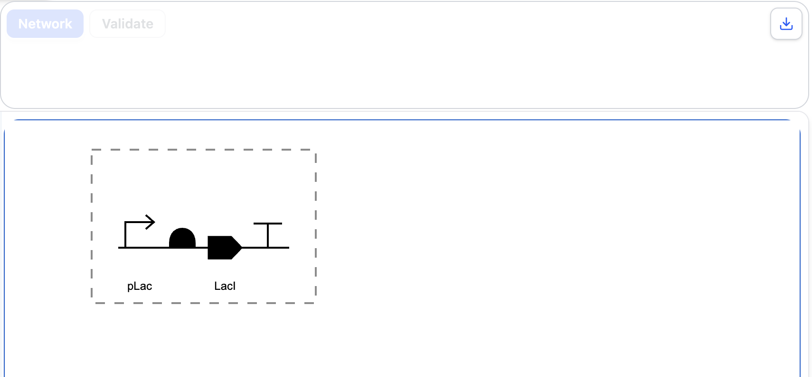
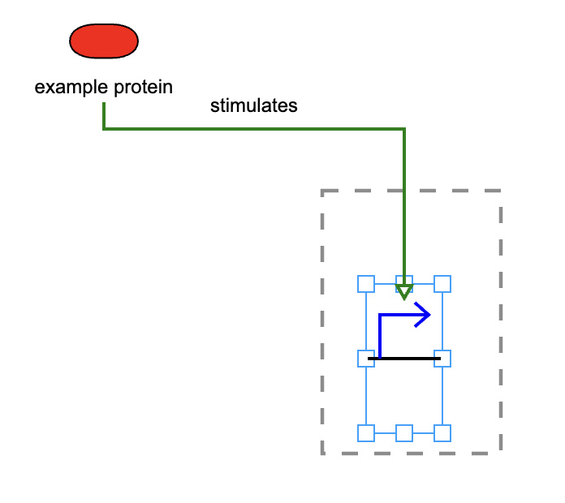

# Sketcher

## Objective

The Sketcher View enables users to create and edit biological design visualisations using a simple and structured text representation.

Instead of manually drawing individual biological entities and their relationships, users describe the design using structured text. SynBioKit interprets this representation and automatically generates the corresponding visualisation.

In this section, you will:

- Create a biological design using a compact text representation
- Use sequence features such as promoters, RBSs, CDSs, and terminators
- Modify visual properties such as labels, positions, colours, and orientation
- Add molecular species and biological interactions
- Examine interaction nodes and more complex representations
- Use predefined examples to explore the supported syntax
- Export the generated visualisation as an image file

---

## Sketcher View

The Sketcher View provides a text-based approach for creating biological design diagrams.

Each statement in the Sketcher text describes a graphical entity, interaction, or connection. The structured text is automatically converted into a visual representation by SynBioKit.

The Sketcher supports several types of biological entities:

| Record Type | Description                              |
| ----------- | ---------------------------------------- |
| `sqf`       | Sequence feature                         |
| `mls`       | Molecular species                        |
| `nds`       | Interaction node                         |
| `int`       | Biological interaction                   |
| `loop`      | Connection between two existing entities |

Each statement ends with a semicolon (`;`), while individual properties within a statement are separated by commas.

---

# Creating a Simple Genetic Design

The simplest way to create a sequence-based design is to use the compact sequence feature syntax.

## Procedure

1. Open the **Sketcher View** in SynBioKit.

2. Remove any existing text from the Sketcher input area.

3. Enter the following design:

```text
promoter, pLac; rbs; cds, LacI; ter;
```

4. Examine the generated visualisation.

## Expected Outcome

SynBioKit should automatically generate a genetic design containing:

**Promoter → RBS → CDS → Terminator**

The labels specified in the input text should also be displayed in the resulting visualisation.

The Sketcher automatically assigns identifiers and positions to sequence features created using this shorthand representation.

> **Observation**
>
> Compare the structured text with the generated visualisation. Examine how individual text statements correspond to graphical elements in the design.

<!-- Add screenshot here -->



---

# Extending the Design

Multiple genetic devices can be described using the same compact representation.

## Procedure

Replace the previous text with:

```text
promoter, pLac; rbs; cds, LacI; ter;

promoter, pTet; rbs; cds, mCherry; ter;
```

Examine the resulting visualisation.

Each line of sequence feature shorthand is automatically placed on a separate backbone.

## Expected Outcome

Two independent genetic devices should be displayed.

The first contains a `pLac` promoter and `LacI` CDS, while the second contains a `pTet` promoter and `mCherry` CDS.

> **Observation**
>
> Examine how the textual organisation of the design affects the layout generated by the Sketcher.

---

# Using Full Drawable Records

The compact representation is useful for rapidly defining sequence-based designs. However, more detailed control is available through full drawable records.

Sequence features, molecular species, and interaction nodes use the following general structure:

```text
type, ref, id, x, y, scaleX, scaleY, flipH, flipV, colour, label;
```

For example:

```text
sqf, promoter, 1, 50, 250, 1, 1, false, false, red, pLac;
sqf, rbs, 2, 95, 250, 1, 1, false, false, blue;
sqf, cds, 3, 140, 250, 1, 1, false, false, #2f8f46, GFP;
sqf, ter, 4, 185, 250, 1, 1, false, false, orange;
```

The main properties include:

| Property           | Description                                  |
| ------------------ | -------------------------------------------- |
| `ref`              | Type of biological entity                    |
| `id`               | Unique identifier within the Sketcher design |
| `x`, `y`           | Position on the canvas                       |
| `scaleX`, `scaleY` | Horizontal and vertical scale                |
| `flipH`, `flipV`   | Horizontal or vertical orientation           |
| `colour`           | Display colour                               |
| `label`            | Label displayed with the entity              |

---

## Modifying Visual Properties

Use the full representation above and modify several visual properties.

### Procedure

1. Change the colour of the CDS.

2. Change its `x` or `y` position.

3. Modify the label.

4. Change one of the `flipH` or `flipV` values from `false` to `true`.

5. Examine how each modification affects the generated visualisation.

Colours may be provided as named values such as:

```text
black
red
```

or as hexadecimal values such as:

```text
#2f8f46
```

## Expected Outcome

Changes made directly in the structured text should be reflected in the generated visualisation.

This demonstrates how both the biological content and graphical properties of the design can be controlled without manually manipulating individual graphical objects.

> **Observation**
>
> Consider how text-based control of position, colour, orientation, and labels can facilitate the creation of reproducible biological diagrams.

---

# Adding Molecular Species and Interactions

The Sketcher is not limited to genetic sequence features.

Molecular species and biological interactions can also be represented, allowing regulatory and molecular relationships to be incorporated into the same design.

In this exercise, a protein will be connected to a promoter through an inhibitory interaction.

## Procedure

Enter the following text:

```text
sqf, promoter, 1, 268.00, 249.00, 1.0, 1.0, false, false, blue, ;
mls, protein, 2, 83.00, 76.00, 1.0, 1.0, false, false, red, example protein;
int, stimulation, 2, 1, green, 3, 40, false, stimulates, bottom, top;
```

## Expected Outcome

The resulting diagram should contain:

- A molecular species representing the `LacI` protein
- A promoter labelled `pLac`
- An inhibitory interaction from LacI to the promoter
- The interaction label `represses`

The interaction record follows the structure:

```text
int, ref, origId, destId, colour, id, height, doubleSided, label, origSide, destSide;
```

The `origId` and `destId` values identify the entities connected by the interaction.

The `origSide` and `destSide` properties determine where the interaction connects to the corresponding graphical entities.

Supported values include:

```text
top
bottom
left
right
```

> **Observation**
>
> Examine how the IDs assigned to biological entities are used to define relationships between them.

<!-- Add screenshot here -->



---

<!--
# Interaction Nodes

The Sketcher also supports interaction nodes that can represent biological processes such as association, dissociation, or other processes.

## Procedure

Enter the following example:

```text
nds, process, 1, 220, 160, 1, 1, false, false, black, transcription;
mls, protein, 2, 100, 100, 1, 1, false, false, black, AraC;
int, stimulation, 2, 1, black, 3, 70, false, activates, bottom, top;
```

## Expected Outcome

The resulting visualisation should contain a molecular species connected to a process node through a stimulation interaction.

This demonstrates that the Sketcher can represent biological systems beyond linear genetic designs.

---


# Creating a Mixed Biological Design

Sequence features, molecular species, and interactions can be combined within a single representation.

Use the following example:

```text
sqf, promoter, 1, 50, 250, 1, 1, false, false, black, pLac;
sqf, rbs, 2, 95, 250, 1, 1, false, false, black;
sqf, cds, 3, 140, 250, 1, 1, false, false, #0b63ce, LacI;
sqf, ter, 4, 185, 250, 1, 1, false, false, black;
sqf, promoter, 5, 280, 250, 1, 1, false, false, black, pLac regulated;
sqf, rbs, 6, 325, 250, 1, 1, false, false, black;
sqf, cds, 7, 370, 250, 1, 1, false, false, #2f8f46, GFP;
sqf, ter, 8, 415, 250, 1, 1, false, false, black;
mls, simple_chemical, 9, 70, 95, 1, 1, false, false, #d17a00, IPTG;
int, inhibition, 3, 5, red, 10, 80, false, LacI repression, top, top;
int, inhibition, 9, 3, #d17a00, 11, 55, false, inducer binds LacI, bottom, bottom;
```

## Expected Outcome

The resulting visualisation should combine:

- Two genetic devices
- Sequence features
- A molecular species
- Multiple biological interactions
- Custom colours
- Interaction labels

This illustrates how the Sketcher can represent a biological system containing multiple entity types and regulatory relationships within a single diagram.
-->

# Predefined Examples

SynBioKit provides predefined Sketcher examples that demonstrate different supported structures and syntax patterns.

These examples can be used to become familiar with:

- Sequence features
- Molecular species
- Interaction nodes
- Biological interactions

## Procedure

1. Open one of the predefined examples available in the Sketcher View.

2. Examine both the structured text and the generated visualisation.

3. Modify one or more properties in the example.

4. Observe how the resulting diagram changes.

Predefined examples provide a useful starting point for creating new designs without requiring the complete text representation to be written manually.

---

# Exporting the Visualisation

Designs generated using the Sketcher can be exported as image files.

## Procedure

1. Complete or select a Sketcher design.

2. Examine the generated visualisation.

3. Select the available image export function.

4. Save the generated visualisation.

## Expected Outcome

The generated diagram should be exported as an image file that can be used outside SynBioKit.

This functionality enables Sketcher-generated diagrams to be incorporated into outputs such as research documentation, presentations, and technical reports.

---

## Further Exploration

Use the predefined examples and the supported Sketcher syntax to construct or modify additional designs.

Consider performing the following exercises:

1. Create a genetic device containing:
   - A promoter
   - An RBS
   - A CDS
   - A terminator

2. Assign labels to the promoter and CDS.

3. Change the colour of the CDS using a hexadecimal colour value.

4. Add a protein molecular species.

5. Add an inhibitory or stimulatory interaction between the molecular species and a sequence feature.

6. Modify the position of the molecular species.

7. Change the interaction routing by modifying the `origSide` and `destSide` values.

8. Export the resulting visualisation as an image.

For more complex designs, interaction nodes and loops can also be incorporated into the representation.

> **Observation**
>
> Consider the advantages and limitations of defining biological diagrams through structured text compared with manually constructing the same graphical representation.

---

## Section Summary

In this section, the Sketcher View was used to create biological design visualisations from structured text.

The exercises demonstrated how SynBioKit can:

- Convert structured text into biological design visualisations
- Rapidly construct sequence-based genetic designs
- Represent sequence features, molecular species, interaction nodes, and biological interactions
- Combine different biological entity types within the same visualisation
- Control visual properties including position, colour, orientation, and labels
- Provide predefined examples as starting points for creating new designs
- Export generated visualisations as image files

The Sketcher therefore provides a flexible alternative to manually drawing biological diagrams. By representing a design as structured text, users can rapidly create, modify, and reproduce graphical representations of biological systems.

Together with the Network View, Validation View, and Converter, the Sketcher extends SynBioKit from the analysis of existing biological design documents to the creation of new biological design visualisations.
